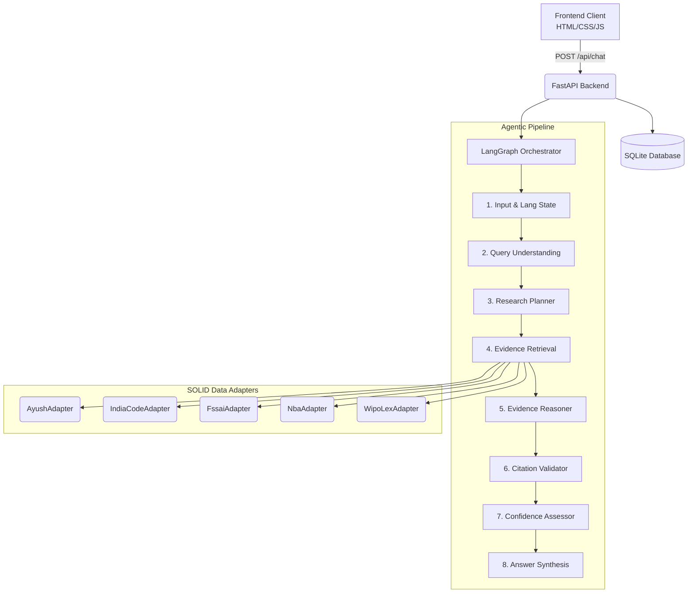
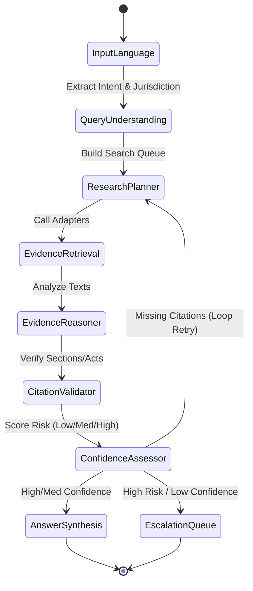
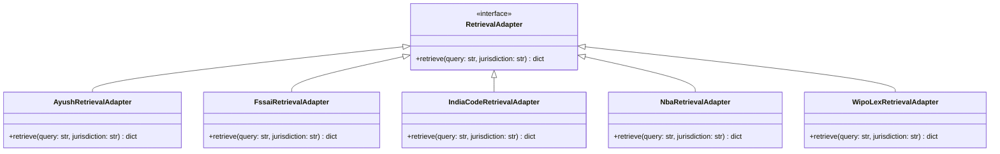
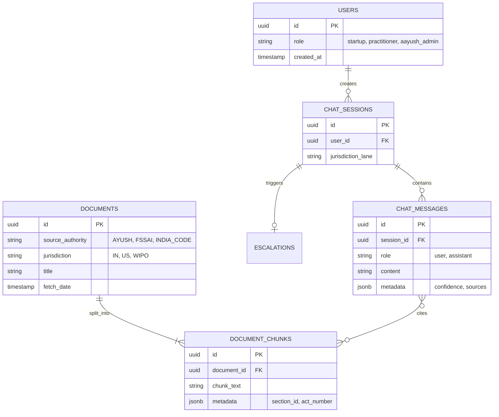

# Ayurveda IP & Regulatory Advisor

An AI-powered legal guidance orchestrator designed for Ayurveda Intellectual Property, Regulatory Compliance (D&C Act, FSSAI), and Access & Benefit Sharing (ABS / NBA).

---

## 🛑 The Problem
Ayurveda practitioners, startups, and researchers face a fragmented and complex legal landscape. Navigating the intersections of the **Drugs & Cosmetics Act**, **FSSAI regulations**, **Biological Diversity Act (ABS compliance)**, and international patent law (WIPO) requires immense domain expertise. Startups frequently face legal action or export bans due to improper classification (e.g., confusing "Ayurveda Aahara" with a proprietary medicine) or missing ABS approvals. Traditional legal consultations are slow, expensive, and often lack cross-domain regulatory knowledge.

## 🛡️ Mitigation
We needed a system that acts as a highly-trained IP Facilitator—not just a generic chatbot, but a deterministic legal reasoning engine. The system must never hallucinate laws; it must actively retrieve, cross-reference, and cite specific Acts, Sections, and Rules. If a query is too vague or carries high legal risk, it must mitigate liability by refusing to answer or escalating to a human expert.

## 💡 How We Solve the Problem
We built a **LangGraph-based Orchestrator** featuring an 8-node deterministic pipeline. 
1. **Dynamic Tool Routing:** The LLM parses the user intent and jurisdiction, deciding exactly which statutory databases (AYUSH, NBA, FSSAI, India Code, WIPO Lex) to query.
2. **SOLID Data Adapters:** We interface with these databases using decoupled retrieval adapters, ensuring strict legal data extraction.
3. **Citation & Feedback Loops:** Our `Citation Validator` node ensures the LLM's response contains hard legal citations. If it doesn't, the graph structurally loops back to fetch more evidence.
4. **Risk Assessment:** A `Confidence Assessor` scores the legal risk of the query. High-risk/low-confidence queries bypass the answer synthesis entirely and are routed to an escalation queue, preventing hallucinatory legal advice.

## ⚡ Latency & Scaling
To ensure real-time enterprise performance (bypassing the slow nature of complex LLM chains):
- **Parallel Retrieval:** The `Evidence Retrieval` node queries all required databases concurrently.
- **Auto-Routing Free Tier:** Configured natively with `openrouter/free` to auto-route LLM requests to the fastest available node (like Gemma-4 or Nemotron), guaranteeing sub-5 second responses.
- **Monolithic Speed:** Designed using a monolithic PostgreSQL + pgvector architecture (modeled here via SQLite for local testing) to avoid the distributed latency of multi-hop microservices.

---

## 🏛 System Architecture

The application is built on a monolithic, highly decoupled architecture using FastAPI, LangGraph, and a local SQLite database, preparing it for highly scalable enterprise environments.



---

## 🧠 LangGraph Pipeline Flow

The orchestrator utilizes **LangGraph Conditional Routing**. If citations are missing, it actively loops back to fetch more evidence. If a query is high-risk and low-confidence, it escalates and bypasses the AI synthesis.



---

## 🧩 SOLID Adapter Design (Class Diagram)

Data ingestion is strictly decoupled. Every source must implement the `RetrievalAdapter` interface, guaranteeing that the Orchestrator (LangGraph) is isolated from web-scraping or API-specific logic.



---

## 🗄️ Database Architecture

The persistence layer tracks sessions, chat histories, documents, and escalations. (Designed for SQLite locally, scales perfectly to PostgreSQL).



---

## 📁 Directory Structure
```
.
├── AGENTS/             # LangGraph nodes, state definitions, and pipeline compilation
├── DATA_SOURCES/       # Raw data sources and dummy files
├── docs/               # Project analysis, DB architecture, and worklogs
├── frontend/           # HTML/CSS UI assets
├── TOOLS/              # Data source retrieval adapters and DB client
├── .env.example        # Template for environment variables
├── .gitignore          # Python and Web standard Git exclusions
├── app.py              # FastAPI server serving the UI and API endpoints
├── database.db         # Local SQLite DB for persistence
└── README.md           # This file
```

---

## 🚀 Setup & Running

1. **Clone the repository**
2. **Setup Environment Variables:**
   ```bash
   cp .env.example .env
   ```
   Add your keys. By default, it uses `openrouter/free` which automatically routes to the best free model available.
3. **Install dependencies:**
   ```bash
   pip install fastapi uvicorn langchain langgraph langchain-openai langchain-google-genai python-dotenv
   ```
4. **Run the server:**
   ```bash
   python3 app.py
   ```
5. **Access the application:** Open `http://localhost:8000` in your browser. Watch the terminal logs to see the pipeline traverse and route the LangGraph nodes in real-time!
