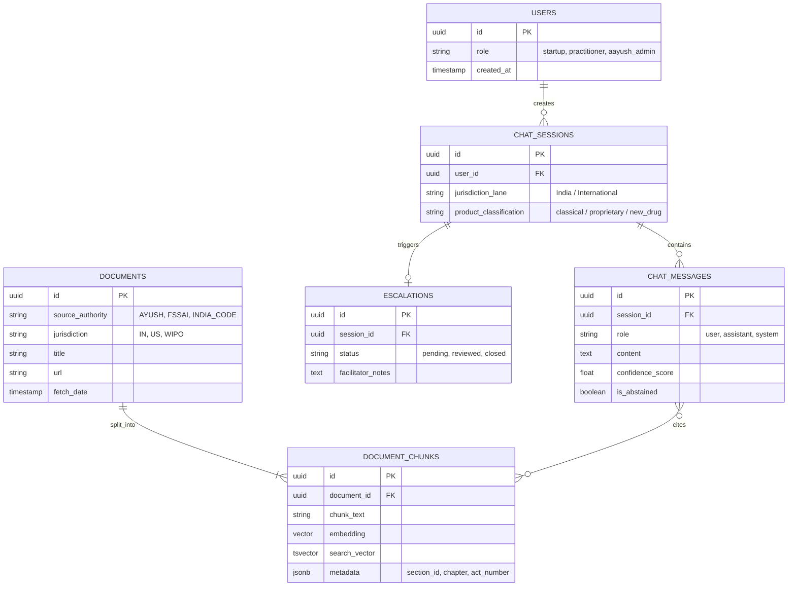

# Database Architecture & Data Modeling

## 1. Overview & Technology Stack
Based on the `VegaVelocity` scaling principles and the hybrid-search RAG requirements defined in the project analysis, the optimal database choice is **PostgreSQL** heavily augmented with the **pgvector** extension. 

*   **Primary Database:** PostgreSQL 15/16
*   **Vector Search:** `pgvector` (HNSW indexing for low-latency dense retrieval)
*   **Keyword Search:** Native Postgres `tsvector` + GIN Indexes (for BM25 exact match)
*   **Connection Pooling:** PgBouncer (Crucial for handling 20,000+ users without connection exhaustion).

By consolidating structured relational data, JSON metadata, dense vectors, and full-text search into a single PostgreSQL monolith, we avoid the distributed latency and "split-brain" consistency issues of maintaining separate SQL and Vector databases (like Chroma/Pinecone).

---

## 2. Entity-Relationship (ER) Diagram

---

## 3. Core Table Definitions & Indexing Strategy

### A. Knowledge Base (RAG Data)

**Table: `documents`**
Holds the parent metadata of the scraped laws.
*   `id` (UUID, Primary Key)
*   `source` (VARCHAR) - Indexed for quick filtering (e.g., 'FSSAI', 'NBA').
*   `jurisdiction` (VARCHAR) - Indexed to ensure strict lane separation (India vs Intl).
*   `title` (VARCHAR)
*   `url` (VARCHAR) - Unique, prevents duplicate scrapes.
*   `last_updated` (TIMESTAMPTZ) - Used to expire/refresh stale laws.

**Table: `document_chunks` (The Heavyweight RAG Table)**
This table acts as the Hybrid Retrieval engine.
*   `id` (UUID, Primary Key)
*   `document_id` (UUID, Foreign Key)
*   `content` (TEXT) - The actual markdown/text chunk.
*   `embedding` (VECTOR(1536)) - Assuming OpenAI `text-embedding-3-small` or BGE embeddings.
*   `text_search` (TSVECTOR) - Generated automatically from `content`.
*   `metadata` (JSONB) - GIN Indexed for flexible filtering (e.g., `metadata->>'section' = '3(d)'`).

**Indexes for `document_chunks`:**
1.  **Vector Index:** `CREATE INDEX ON document_chunks USING hnsw (embedding vector_cosine_ops);` (P95 latency < 10ms for vector search).
2.  **Keyword Index:** `CREATE INDEX ON document_chunks USING gin (text_search);`
3.  **Metadata Index:** `CREATE INDEX ON document_chunks USING gin (metadata);`

### B. User Interactions & Telemetry

**Table: `chat_sessions`**
*   `id` (UUID, Primary Key)
*   `user_id` (UUID, nullable) - Supports guest sessions.
*   `jurisdiction_lane` (VARCHAR) - Stored at session level to prevent cross-contamination.
*   `intent_class` (VARCHAR) - 'IP', 'Regulatory', 'ABS'.

**Table: `chat_messages`**
*   `id` (UUID, Primary Key)
*   `session_id` (UUID, Foreign Key)
*   `role` (VARCHAR) - user, assistant.
*   `content` (TEXT)
*   `cited_chunk_ids` (UUID[]) - Crucial for the "Citation Verifier". Links exactly which laws were quoted.
*   `confidence_score` (FLOAT)
*   `abstained` (BOOLEAN) - Evaluates LangGraph's safety (did it correctly say "I don't know"?).

**Table: `escalations` (Human-in-the-Loop)**
*   `id` (UUID)
*   `session_id` (UUID) - Links the Human IP Facilitator to the exact conversation context.
*   `status` (VARCHAR) - pending, resolved.

---

## 4. VegaVelocity Scalability Optimizations

1.  **Connection Pooling (PgBouncer):**
    With an expected 20,000+ users, allowing the LangGraph backend to open a direct database connection per request will instantly crash PostgreSQL (Connection Exhaustion). We will mandate `PgBouncer` running in `transaction pooling mode`.
2.  **Table Partitioning:**
    The `chat_messages` table will grow exponentially. We will implement **Time-based Table Partitioning** (e.g., partitioning `chat_messages` by month). This ensures fast writes and cheap archival of old chat logs.
3.  **JSONB for Agility:**
    Since scraping structures from FSSAI, AYUSH, and WIPO differ vastly, hardcoding columns for legal attributes (like "gazette_number") is brittle. The `metadata (JSONB)` column allows the database to adapt to any schema while remaining entirely queryable via GIN indexes.
4.  **Read-Replicas for Vectors:**
    Vector HNSW distance calculations are CPU-intensive. For production (Gate 2: Performance Validation), we split writes (chat logs) to the Primary DB, and route heavy `similarity_search` vector read queries to a PostgreSQL Read-Replica.
